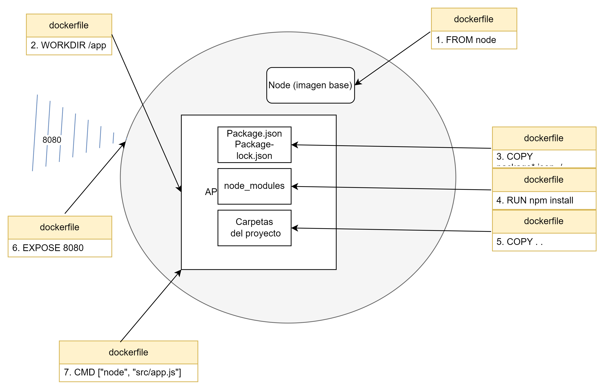

## Contenerización con Docker

### CONTENEDORES 

#### ¿Qué son? 

Los contenedores son entornos o unidades de software estandarizadas e isoladas (aisladas) en las que se puede crear, probar, e implementar aplicativos con todas las configuraciones necesarias para su ejecución.

Esta tecnología a diferencia de las máquinas virtuales, en las que se les debe instalar un sistema operativo, se ejecutan utilizando los elementos básicos del kernel del sistema operativo sobre el que fue creado el contenedor.

De esta forma, los contenedores adquieren lo mejor del mundo de las máquinas virtuales (aislamiento y conexión controlada mediante un puerto) y lo mejor de la programación tradicional en los que las aplicaciones se creaban sobre la base de un mismo sistema operativo aprovechando su kernel sin la necesidad de tener que instalar un sistema operativo por aplicación.

### DOCKER

#### ¿Qué es?

Es una plataforma gestora de contenedores que permite empaquetar aplicativos que correrán sobre el kernel del sistema operativo de origen.

#### ¿Proceso de contenerización?

El proceso de contenerización con Docker consiste básicamente en 3 pasos:

* Paso 1: construcción del dockerfile

Se debe crear un archivo dockerfile en el proyecto, el cual contendrá las instrucciones necesarias para que docker pueda generar la imagen (blueprint) del aplicativo a contenerizar.

- Código de ejemplo

FROM node

WORKDIR /app

COPY package*.json ./

RUN npm install

COPY . .

EXPOSE 8080

ENV PERSISTENCE=MONGO
ENV MODE=dev

CMD ["node", "src/app.js", "--persistence", "${PERSISTENCE}", "--mode", "${MODE}"]

- Explicación del ejemplo

---> Primer paso: 

Crear el archivo dockerignore para evitar una doble instalación de node_modules (una vez creado el archivo colocar "node_modules" -sin comillas-).

---> Segundo paso:

*NOTA: los nombres de los archivos y parámetros van sin comillas, solo se escribieron con comillas para diferenciar expresiones en el texto*

FROM node: indica la imagen base a partir de la cual se construirá la imagen (puede ser node, node:alpine, etc.).
WORKDIR /app: determina dónde vivirá el proyecto (una suerte de carpeta dentro del entorno aislado).
COPY package*.json ./: establece que los archivos que tengan en su nombre "package.json" se guardarán en el directorio raíz.
RUN npm install: automatiza le ejecución del comando "npm install" a fin de instalar la carpeta node_modules.
COPY . .: indica que se copiará todo lo que está al nivel del dockerfile (directorio raíz) se guardará al nivel del WORKDIR /app.
EXPOSE 8080: define el puerto de comunicación del contenedor para conectarse con otros entornos (en este caso el puerto 8080).
CMD ["node", "src/app.js"]: ejecuta el comando "node" y se define los parámetros que se le deben pasar (en este caso "src/app.js").

* Paso 2:
* Paso 3:

